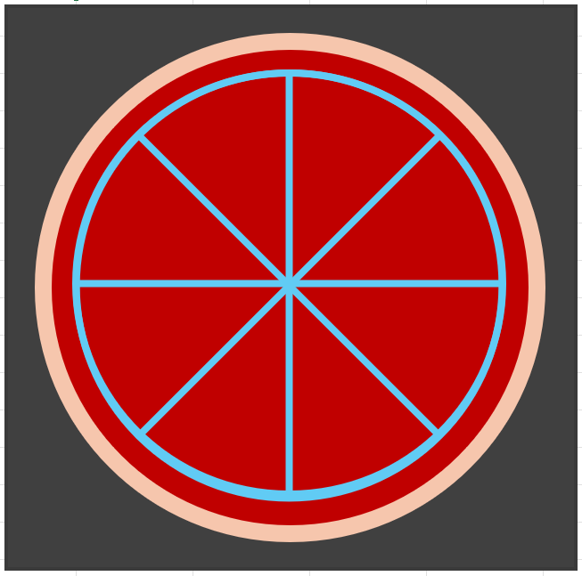
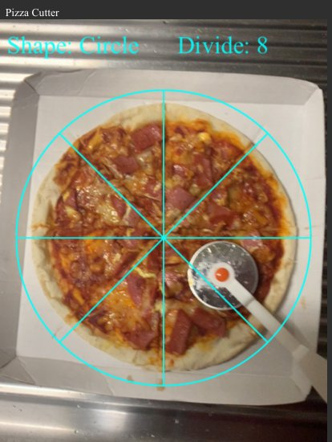
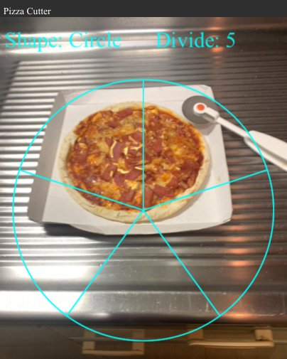
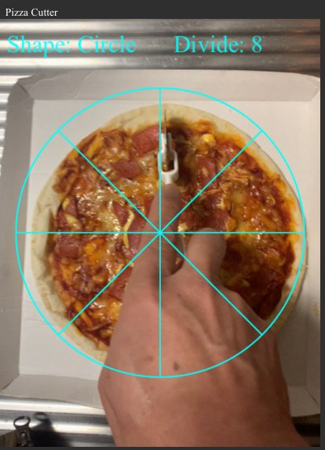
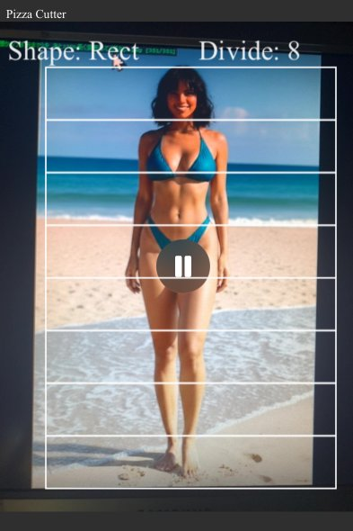
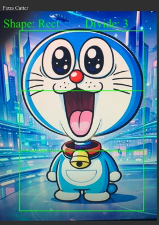

Demo
  https://maruzilla.github.io/PizzaCutter/

## 概要
ピザ、またはケーキなどを正確に均等にカットする、ただそれだけの ARアプリ。
スマホのカメラをかざし、画面のガイドラインをモニターしながらピザを切ってください。

## 使い方
* ダブルタップで円形と長方形のモード切り替え。
    （しかも効果音付き! ww）

* タップする横位置でガイドラインの色を変える。
    (左から、黒 -> 紺 -> 橙 -> マジェンタ -> 緑 -> 黄 -> シアン -> 白)

* 縦にスワイプして、何等分にするかを指定。
    （範囲は２～２０）

* スマホのカメラをピザの真上からかざし、ガイドラインに沿って切る。

## さらに、こんな使い方も有り !
スタイルの良い Sexyビキニモデルの姉ちゃんとか、お気に入りの漫画のキャラを PCでネットサーフィン中に見つけたら、長方形モードにして何頭身かを測ってみる、みたいな。ww

８頭身！

2/3 = 1.5頭身？

## 免責事項:
* このプログラムを自由に改変しても構いません。
* 改変し、もっとオモシロいのを作ったら、作者にご一報ください。 (^^
* プログラムの結果によって生じたいかなる損害についても、作者は一切の責任を負いません。m(._.)m

## Enjoy hacking!!

sample-sexy-latina

sample-raemondo

